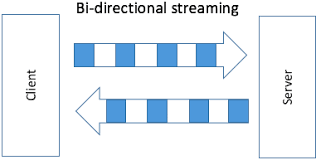

# Bidirectional Streaming gRPC in Go

Bidirectional streaming RPCs are a type of RPC where both the client and the server send a sequence of messages to each other. The two streams operate independently, so clients and servers can read and write in whatever order they like. Here's how you can implement a bidirectional streaming gRPC service in Go:

<div style="text-align:center">
    
</div>

## Step 1: Define the Service

First, you need to define the service in your `.proto` file. Here's an example:

```protobuf
syntax = "proto3";

package tutorial;

message NumberRequest {
  int32 num = 1;
}

message NumberResponse {
  int32 sum = 1;
}

service NumberService {
  rpc AccumulateNumbers (stream NumberRequest) returns (stream NumberResponse);
}
```

In this example, the `NumberService` has a bidirectional streaming RPC method `AccumulateNumbers` that takes a stream of `NumberRequest` messages and returns a stream of `NumberResponse` messages.

## Step 2: Generate Go Code

After defining your service, you can generate the Go code using the `protoc` compiler:

```bash
protoc --go_out=plugins=grpc:. *.proto
```

This command generates a `.pb.go` file with the same name as your `.proto` file. This file contains the Go code for your service and messages.

## Step 3: Implement the Server

Next, you need to implement the server. Here's an example:

```go
package main

import (
  "io"
  "log"
  "net"

  pb "path/to/your/package"

  "google.golang.org/grpc"
)

type server struct{}

func (s *server) AccumulateNumbers(stream pb.NumberService_AccumulateNumbersServer) error {
  sum := 0
  for {
    req, err := stream.Recv()
    if err == io.EOF {
      return nil
    }
    if err != nil {
      return err
    }
    sum += int(req.Num)
    if err := stream.Send(&pb.NumberResponse{Sum: int32(sum)}); err != nil {
      return err
    }
  }
}

func main() {
  lis, err := net.Listen("tcp", ":50051")
  if err != nil {
    log.Fatalf("failed to listen: %v", err)
  }
  s := grpc.NewServer()
  pb.RegisterNumberServiceServer(s, &server{})
  if err := s.Serve(lis); err != nil {
    log.Fatalf("failed to serve: %v", err)
  }
}
```

In this example, the `AccumulateNumbers` method receives a stream of numbers from the client, accumulates them, and sends back the sum after each number.

## Step 4: Implement the Client

Finally, you need to implement the client. Here's an example:

```go
package main

import (
  "context"
  "io"
  "log"
  "os"
  "time"

  pb "path/to/your/package"

  "google.golang.org/grpc"
)

func main() {
  conn, err := grpc.Dial("localhost:50051", grpc.WithInsecure(), grpc.WithBlock())
  if err != nil {
    log.Fatalf("did not connect: %v", err)
  }
  defer conn.Close()
  c := pb.NewNumberServiceClient(conn)

  ctx, cancel := context.WithTimeout(context.Background(), time.Second)
  defer cancel()
  stream, err := c.AccumulateNumbers(ctx)
  if err != nil {
    log.Fatalf("could not accumulate numbers: %v", err)
  }
  go func() {
    for i := 1; i <= 10; i++ {
      if err := stream.Send(&pb.NumberRequest{Num: int32(i)}); err != nil {
        log.Fatalf("could not send: %v", err)
      }
    }
    stream.CloseSend()
  }()
  for {
    res, err := stream.Recv()
    if err == io.EOF {
      break
    }
    if err != nil {
      log.Fatalf("could not receive: %v", err)
    }
    log.Printf("Sum: %d", res.GetSum())
  }
}
```

In this example, the client sends a stream of numbers from 1 to 10 to the server and prints the accumulated sum after each number.

