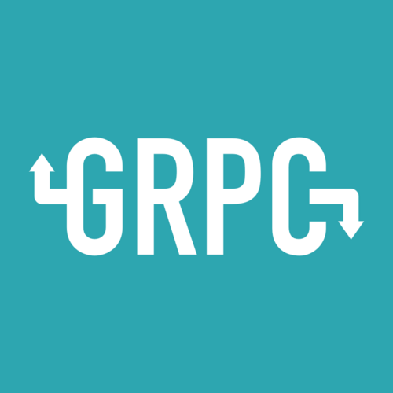
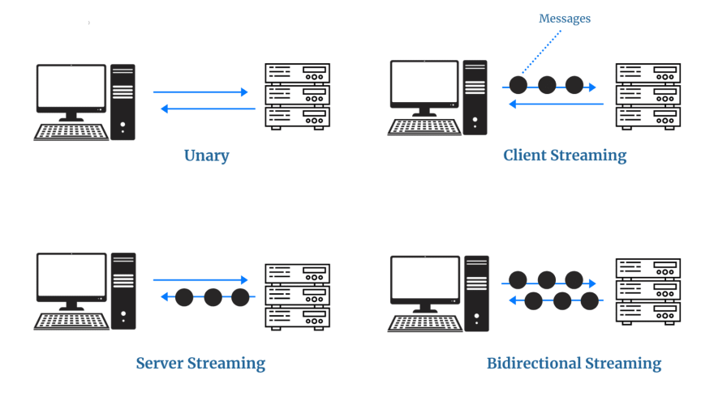

# gRPC in Go Tutorial

Welcome to this repository! This is a comprehensive guide designed to teach you gRPC in Go. gRPC is a high-performance, open-source universal RPC framework developed by Google. In this tutorial, we will cover everything from the basics of protocol buffers to the complexities of bi-directional streaming.

    

## Table of Contents

1. [Introduction to Protocol Buffers](./protobuf.md)
2. [Unary gRPC](./unary.md)
3. [Server Streaming gRPC](./server_streaming.md)
4. [Client Streaming gRPC](./client_streaming.md)
5. [Bi-directional Streaming gRPC](./bidirectional_streaming.md)
6. [gRPC Error handling](./error.md)
7. [deadlines](./deadline.md)
8. [SSL](./ssl.md)

Each section is a markdown file that provides a detailed explanation and examples. Let's dive in!

## Getting Started

Before we start, make sure you have Go installed on your machine. If not, you can download it from the [official Go website](https://golang.org/dl/). You will also need to install the protocol buffer compiler `protoc` from the [protocol buffers GitHub repository](https://github.com/protocolbuffers/protobuf).

    

## What is gRPC?

gRPC (Google Remote Procedure Call) is an open-source remote procedure call system developed by Google. It uses Protocol Buffers (protobuf) as its interface definition language, allowing developers to define services and message types in `.proto` files. gRPC supports four kinds of service method which are Unary RPC, Server streaming RPC, Client streaming RPC, and Bidirectional streaming RPC.

    

## Why gRPC?

gRPC has many advantages over traditional HTTP/JSON APIs:

- **Performance**: gRPC uses HTTP/2 for transport and Protocol Buffers as its interface definition language, making it faster and more efficient than JSON.
- **Streaming**: gRPC supports server-side, client-side, and bi-directional streaming.
- **Language-agnostic**: You can generate gRPC client and server code in many languages, including Go, Java, C++, Python, Ruby, etc.

## What's the Next Step?

If you follow the table of contents and go through each section of this tutorial, you will gain a solid understanding of gRPC by the end. This knowledge will equip you to create efficient and high-performing microservices using gRPC in Go.

