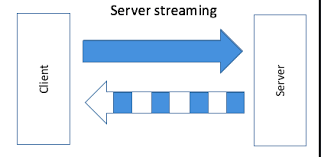

# Server Streaming gRPC in Go

Server streaming RPCs are a type of RPC where the client sends a single request to the server and gets a stream of responses back. Here's how you can implement a server streaming gRPC service in Go:

<div style="text-align:center">
    
</div>

## Step 1: Define the Service

First, you need to define the service in your `.proto` file. Here's an example:

```protobuf
syntax = "proto3";

package tutorial;

message NumberRequest {
  int32 max = 1;
}

message NumberResponse {
  int32 num = 1;
}

service NumberService {
  rpc ListNumbers (NumberRequest) returns (stream NumberResponse);
}
```

In this example, the `NumberService` has a server streaming RPC method `ListNumbers` that takes a `NumberRequest` and returns a stream of `NumberResponse` messages.

## Step 2: Generate Go Code

After defining your service, you can generate the Go code using the `protoc` compiler:

```bash
protoc --go_out=plugins=grpc:. *.proto
```

This command generates a `.pb.go` file with the same name as your `.proto` file. This file contains the Go code for your service and messages.

## Step 3: Implement the Server

Next, you need to implement the server. Here's an example:

```go
package main

import (
  "context"
  "log"
  "net"

  pb "path/to/your/package"

  "google.golang.org/grpc"
)

type server struct{}

func (s *server) ListNumbers(req *pb.NumberRequest, stream pb.NumberService_ListNumbersServer) error {
  for i := 1; i <= int(req.Max); i++ {
    if err := stream.Send(&pb.NumberResponse{Num: int32(i)}); err != nil {
      return err
    }
  }
  return nil
}

func main() {
  lis, err := net.Listen("tcp", ":50051")
  if err != nil {
    log.Fatalf("failed to listen: %v", err)
  }
  s := grpc.NewServer()
  pb.RegisterNumberServiceServer(s, &server{})
  if err := s.Serve(lis); err != nil {
    log.Fatalf("failed to serve: %v", err)
  }
}
```

In this example, the `ListNumbers` method sends a stream of numbers from 1 to the input number.

## Step 4: Implement the Client

Finally, you need to implement the client. Here's an example:

```go
package main

import (
  "context"
  "log"
  "os"
  "time"

  pb "path/to/your/package"

  "google.golang.org/grpc"
)

func main() {
  conn, err := grpc.Dial("localhost:50051", grpc.WithInsecure(), grpc.WithBlock())
  if err != nil {
    log.Fatalf("did not connect: %v", err)
  }
  defer conn.Close()
  c := pb.NewNumberServiceClient(conn)

  ctx, cancel := context.WithTimeout(context.Background(), time.Second)
  defer cancel()
  stream, err := c.ListNumbers(ctx, &pb.NumberRequest{Max: 10})
  if err != nil {
    log.Fatalf("could not list numbers: %v", err)
  }
  for {
    res, err := stream.Recv()
    if err == io.EOF {
      break
    }
    if err != nil {
      log.Fatalf("could not receive: %v", err)
    }
    log.Printf("Number: %d", res.GetNum())
  }
}
```

In this example, the client requests a stream of numbers up to 10 and prints each number.


